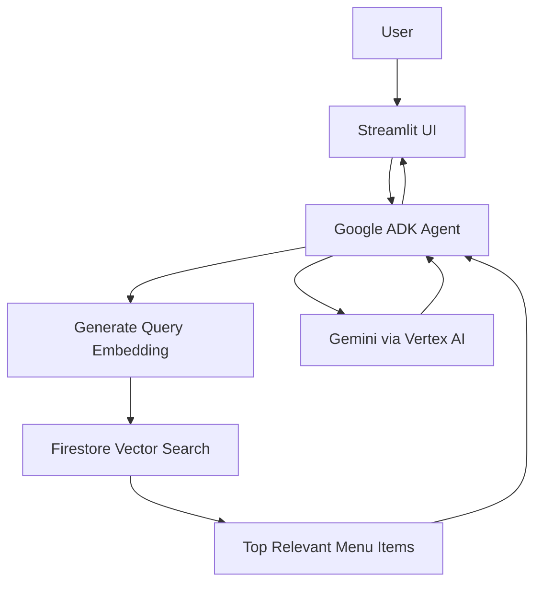

# ☕ Coffee Barista AI Agent

An AI-powered coffee shop assistant built with **Google ADK, Gemini on Vertex AI, Streamlit, Cloud Firestore, Vector Search, and Cloud Run**.

The agent recommends drinks and pastries based on customer preferences while grounding its responses in actual menu data. The project starts with a simple local JSON retrieval approach and is extended to use **Firestore Vector Search and text embeddings** for dynamic semantic retrieval.

## Overview

The Coffee Barista Agent demonstrates how a generative AI model can be integrated into a broader cloud application rather than used as a standalone chatbot.

The application can:

* recommend menu items based on natural-language preferences;
* avoid recommending products that are not available;
* consider dietary and allergen requirements;
* retrieve semantically relevant menu items using vector search;
* reflect menu changes stored in Firestore without rebuilding the application;
* run as a serverless web application on Google Cloud Run.

## Architecture



### Retrieval Flow

For each recommendation request:

1. The user submits a natural-language query.
2. The agent generates an embedding for the query.
3. Firestore Vector Search compares the query embedding against stored menu embeddings.
4. Only the most semantically relevant menu items are retrieved.
5. The retrieved menu data is passed to the agent as grounded context.
6. Gemini generates a response based on that retrieved data.

This avoids sending the entire menu dataset to the model on every request and allows the menu to change independently from the deployed application.

## Evolution of the Project

### Version 1 — Local Menu Retrieval

The initial prototype stored menu data in `menu.json`.

```text
User
  ↓
ADK Agent
  ↓
get_menu()
  ↓
menu.json
  ↓
Gemini
  ↓
Response
```

This approach is simple and useful for prototyping, but changing menu data requires modifying the application files and redeploying the service.

### Version 2 — Firestore + Vector Search

The project was then extended with Cloud Firestore and vector embeddings.

```text
User Query
    ↓
Embedding
    ↓
Firestore Vector Search
    ↓
Relevant Menu Items
    ↓
ADK Agent + Gemini
    ↓
Response
```

Menu data can now be updated directly in Firestore. The running Cloud Run application can retrieve the new data without rebuilding or redeploying the application.

## Features

* ☕ Conversational AI barista
* 🔎 Semantic menu retrieval
* 🧠 Gemini-powered recommendations
* 🛠️ Google ADK tool integration
* 🥛 Dietary and allergen-aware recommendations
* 🚫 Grounding against unavailable menu items
* 🔥 Dynamic menu updates through Firestore
* 📐 Vector similarity search
* 💬 Streamlit chat interface
* ☁️ Serverless Cloud Run deployment
* 🔐 Dedicated IAM service account with least-privilege permissions

## Tech Stack

| Component          | Technology                         |
| ------------------ | ---------------------------------- |
| Language           | Python                             |
| Agent Framework    | Google Agent Development Kit (ADK) |
| LLM                | Gemini via Vertex AI               |
| Web Interface      | Streamlit                          |
| Database           | Cloud Firestore                    |
| Semantic Retrieval | Firestore Vector Search            |
| Embeddings         | Vertex AI text embeddings          |
| Runtime            | Google Cloud Run                   |
| Build              | Cloud Build + Buildpacks           |
| Container Storage  | Artifact Registry                  |
| Authentication     | Google Cloud IAM / Service Account |

## Project Structure

```text
coffee-barista-agent/
├── agent.py          # ADK agent, retrieval tool, and model configuration
├── app.py            # Streamlit user interface and agent runner
├── menu.json         # Original local menu dataset
├── seed.py           # Seeds Firestore with menu data and embeddings
├── requirements.txt  # Python dependencies
├── .gitignore
└── README.md
```

## How the Agent Is Grounded

The agent is instructed to recommend only products retrieved from the menu data.

In the Firestore implementation, `get_menu(query)`:

1. creates an embedding for the user's query;
2. searches the `menu` collection using Firestore Vector Search;
3. retrieves the top matching menu items;
4. removes embedding vectors before sending menu data to the LLM;
5. returns only useful product information to the agent.

Removing embedding vectors from the model context reduces unnecessary token usage because the vectors are needed for retrieval, not response generation.

## Dynamic Data Example

A new menu item can be inserted directly into Firestore with its embedding.

After refreshing the application:

```text
Firestore update
      ↓
No Cloud Run redeployment
      ↓
Application queries Firestore
      ↓
New item becomes retrievable
```

This was tested by adding a **Matcha Green Tea Latte** after deployment. The application immediately displayed and retrieved the new item without rebuilding the Cloud Run service.

## Cloud Deployment

The application is deployed directly from source:

```text
Source Code
    ↓
Cloud Build
    ↓
Google Buildpacks
    ↓
Container Image
    ↓
Artifact Registry
    ↓
Cloud Run
```

A custom Dockerfile is not required for this project because Google Buildpacks detect the Python application and its dependencies automatically.

## IAM and Security Design

Cloud Run runs the application using a dedicated service account rather than a broad default runtime identity.

The service account is granted only the permissions required by the application:

```text
roles/aiplatform.user
roles/datastore.user
```

This follows the **Principle of Least Privilege**: the application receives only the permissions required to access Vertex AI and Firestore.

No API keys or service-account private keys are stored in the source code.

Authentication between the deployed application and Google Cloud services is handled through the Cloud Run service identity and IAM.

## Running the Project

### Requirements

* Python 3
* Google Cloud project
* Vertex AI enabled
* Cloud Firestore database
* Google Cloud authentication configured
* Required IAM permissions

Install Python dependencies:

```bash
pip install -r requirements.txt
```

The application expects Google Cloud configuration to be supplied through the environment rather than hard-coded credentials.

Typical cloud environment configuration includes:

```text
GOOGLE_GENAI_USE_VERTEXAI=TRUE
GOOGLE_CLOUD_PROJECT=<YOUR_PROJECT_ID>
GOOGLE_CLOUD_LOCATION=<YOUR_LOCATION>
```

Before running the Firestore-based version, the database must be populated and the required vector index must exist.

## Key Dependencies

```text
google-adk==2.2.0
streamlit==1.58.0
google-cloud-firestore==2.27.0
google-genai==2.11.0
```

## What I Learned

This project helped me understand how several AI and cloud components fit together in an end-to-end application:

* building agents with Google ADK;
* grounding LLM responses using external data;
* function/tool calling;
* embeddings and semantic similarity;
* vector retrieval;
* Firestore as a dynamic data source;
* IAM and service accounts;
* least-privilege access control;
* source-based container builds;
* serverless deployment with Cloud Run;
* the difference between application source, container images, and running cloud services.

A particularly useful lesson was the transition from a static local data source to runtime semantic retrieval:

```text
Static JSON
    ↓
Tool-based grounding
    ↓
Firestore
    ↓
Embeddings
    ↓
Vector Search
    ↓
Dynamic RAG-style retrieval
```

## Project Context

This project was built while completing **Google Gen AI Academy APAC Cohort 3**.

The initial implementation follows the Academy's Google Cloud codelab for building and deploying a customer-facing AI agent. I also completed the codelab's optional Firestore and Vector Search extension to explore a more dynamic retrieval architecture.

This repository documents my implementation and the engineering concepts I learned while completing and extending the lab.

## Notes

This repository is primarily an educational AI engineering project.

The current implementation is suitable for learning and prototyping. A production deployment would require additional considerations such as authentication, rate limiting, persistent conversation storage, monitoring, automated testing, stronger web security configuration, and cost controls.
cd ~/coffee-barista-agent
cloudshell edit README.md